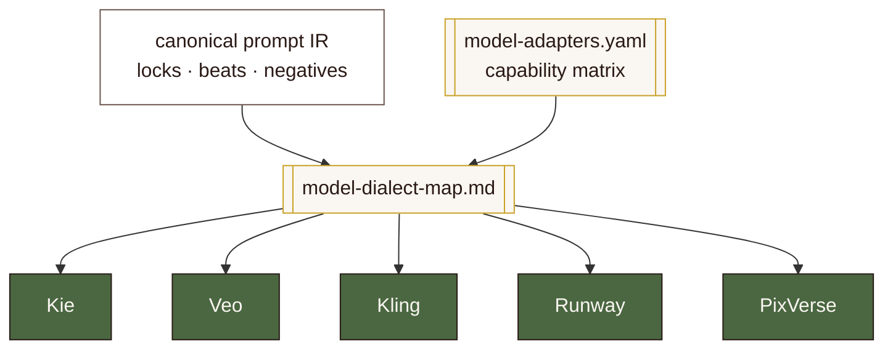
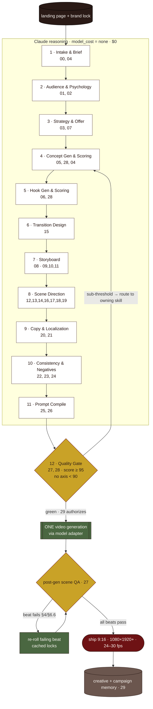

# AI ADS STUDIO — SYSTEM ARCHITECTURE

> **Scope.** How the framework is built: the layered design, the artifact graph
> from landing page to finished video, the single-generation economics, the
> quality-gate control loop, and the extensibility model (new video model, new
> product, new market). This document is subordinate to `STUDIO-BIBLE.md`. Where
> the two ever disagree, **the Bible wins** and this file is regenerated.
>
> **Design mandate (from the Bible §0).** _Reason like a $500k creative agency,
> spend like a startup. Never send a prompt to a video model until every quality
> gate is green._ Three priorities, in strict order: **Realism → Conversion →
> Cost discipline.** Every architectural decision below exists to serve those
> three, in that order.

---

## 1. Architectural principles

The whole system is a compiler. It takes a **landing page + a brand lock** as
source, runs a deterministic, gated, all-in-Claude reasoning pass, and emits
**exactly one** optimized prompt for **exactly one** video generation. The four
load-bearing principles:

| # | Principle | Consequence in the architecture |
|---|-----------|--------------------------------|
| P1 | **Single source of truth** | `STUDIO-BIBLE.md` is the keystone. Product facts (§3), the product lock (§4), market/platform rules (§5), the flagship creative (§6), quality gates (§7). No layer may invent product claims; every number traces back here. |
| P2 | **Reason-then-render** | All 30 skills run at `model_cost: none` — they reason inside Claude. The only paid call is the final video generation, and only after Stage 12 is green. |
| P3 | **Locks over vibes** | The bottle/label/cap/liquid (§4) and the negatives (§6.6) are compiled to immutable descriptor strings that are byte-identical across every beat and every regeneration. Consistency is enforced by string identity, not by hoping the model behaves. |
| P4 | **Regenerate scenes, never videos** | The creative is a **segmented, continuous** beat sheet (§6.1). A QA failure re-rolls the failing beat with its cached locked descriptors — never the whole cut. Cost scales with defects, not with attempts. |

---

## 2. The layered design

Eight layers. Each owns one concern and exposes a stable contract to the layer
above. Dependencies point **downward and inward toward the Bible** — no layer
reaches sideways into a peer's internals; it consumes that peer's published
artifact.

```
                    ┌─────────────────────────────────────────┐
   authority ▲      │            STUDIO-BIBLE.md               │  ← P1 keystone
   (Bible    │      │   product facts · locks · flagship · QA  │
    wins)    │      └─────────────────────────────────────────┘
             │        ▲        ▲        ▲        ▲        ▲
        ┌────┴───┐ ┌──┴───┐ ┌──┴────┐ ┌─┴─────┐ ┌┴──────┐ ┌┴────────┐
        │ CONFIG │ │ KNOW │ │SKILLS │ │TEMPLAT│ │PROMPT │ │ QUALITY │
        └────────┘ └──────┘ └───────┘ └───────┘ │BUILDER│ └─────────┘
             │        │         │         │      └───────┘      │
             └────────┴─────────┴─────────┴──────────┴──────────┘
                                 │
                       ┌─────────┴─────────┐
                       │  MEMORY   ·   EXAMPLES  │  ← learn + prove
                       └───────────────────────┘
```

### 2.1 Layer contracts

| Layer | Directory | Owns (single responsibility) | Key files | Read by |
|-------|-----------|------------------------------|-----------|---------|
| **Config** | `config/` | Machine-readable knobs, thresholds, brand/market/platform/model **data** — no prose reasoning. | `studio.config.yaml` (global thresholds/defaults), `markets.yaml` (KSA·UAE·Oman·Egypt), `platforms.yaml` (Meta·TikTok·Snap specs, safe zones, hook windows), `model-adapters.yaml` (Kie·Veo·Kling·Runway·PixVerse capability matrix), `brand/mechat-red-oil.brand.yaml` (flagship product lock) | Skills, Prompt-Builders, Quality |
| **Knowledge** | `knowledge/` | Reference material: ad craft, cinematography, hair/oil realism, culture, negatives. Dense, checklist-heavy, named techniques. | ads/craft/negatives docs, `gulf-culture/` (saudi·uae·oman·egypt) | Skills (as retrieval), Quality |
| **Skills** | `skills/00–29` | The 30 reasoning specialists (Bible §1 numbering). Each is a SKILL.md authored to §2 conventions. Skills **reason**; they never call a model (`model_cost: none`). | `NN-name/SKILL.md` × 30 | Orchestrator (00) sequences them |
| **Templates** | `templates/` | The fill-in shape of every artifact: brief → concepts → hooks → storyboard → shot list → copy → A/B test. Structure without content. | brief / concept-grid / hook-grid / storyboard / shot-list / copy-sheet / ab-test templates | Skills (fill them), Examples (instantiate them) |
| **Prompt-Builders** | `prompt-builders/` | Compilation: assemble locked descriptors + beat sheet + negatives into **one** model prompt; map to each model's dialect. | prompt compiler, negatives core (§6.6), `model-dialect-map.md` | Skills 25/26, Quality 27 |
| **Quality** | `quality/` | The 10-axis rubric and the pre-flight + post-gen checklists. The gate that blocks any model call. | `scoring-rubric.md`, pre-gen checklist, post-gen scene-QA checklist | Skills 27/28, Orchestrator |
| **Memory** | `memory/` | Creative memory (what scored well and why) + campaign memory (what shipped, what it cost, how it performed). Closes the learning loop. | creative-memory, campaign-memory logs | Skills 05/06/28 (priors), 29 (cost history) |
| **Examples** | `examples/mechat-red-oil/` | The fully worked flagship ad, files 00–13, proving §3–§6 end to end with **zero contradiction**. The golden reference and regression fixture. | 00–13 (brief → post-gen QA) | Humans + skills as few-shot exemplars |
| Assets / Cache | `assets/`, `cache/` | Asset-naming conventions (points to repo `/assets`); the prompt-cache convention (see §4). | conventions + cache manifests | Prompt-Builders, Cost-Optimizer (29) |

**Why this split.** Config is data so it can change without touching reasoning.
Knowledge is retrieval so craft can deepen without editing skills. Skills are
stateless reasoners so they compose in any order the Orchestrator chooses.
Prompt-Builders isolate the one place model-specific syntax lives, so adding a
model touches one layer. Quality is a hard gate, not advice. Memory is the only
layer that carries state between runs.

---

## 3. The artifact graph (landing page → final video)

The pipeline is a directed acyclic graph of **artifacts**, each produced by
named skills and consumed downstream. The `examples/mechat-red-oil/` files
00–13 are the canonical instantiation; the flagship product
**زيت المشاط الأحمر** — *Zayt al-Mishāṭ al-Aḥmar* (Red Mechat Oil) — flows
through every node, and the winning concept
**«القطرة التي تُعيد الحياة»** — *al-Qaṭra allatī tuʿīd al-ḥayāt* ("The Drop That
Brings Hair Back to Life", codename **UNBROKEN THREAD**) — is fixed at Stage 4.

### 3.1 Artifact ledger

| Stage | Artifact (example file) | Produced by | Consumes | Key locked content it carries forward |
|------|--------------------------|-------------|----------|----------------------------------------|
| — | **Landing page** (external) | — | — | Source of all product facts (Bible §3). |
| — | **Brand lock** `config/brand/mechat-red-oil.brand.yaml` | Onboarding | Landing page + Bible §4 | Bottle/label/cap/liquid lock, palette, offer. |
| 1 | **Creative brief** `00-brief.md` | 00-orchestrator, 04-creative-director | Landing page, brand lock | Product truth, offer **139 SAR / 3-pack / COD**, tone. |
| 2 | **Audience & psychology** `01-audience-psychology.md` | 01-audience-analyzer, 02-consumer-psychology | Brief | ICP (women ~22–45, KSA-primary), awareness stages, triggers (hope + restored femininity; heritage trust). |
| 3 | **Strategy & offer** `04-strategy-offer.md` | 03-marketing-strategist, 07-offer-optimizer | Brief, audience | Angle, funnel, CTA framing **«اطلبي الآن — الدفع عند الاستلام»** (*uṭlubī al-ān — ad-dafʿ ʿind al-istilām*, "Order now — Cash on delivery"), metric targets (Scroll-Stop/Hook/Hold/CTR/CVR/ROAS). |
| 4 | **Concepts, scored** `02-concepts-scored.md` | 05-creative-concept-generator, 28-scoring-engine, 04-creative-director | Strategy, psychology | 20 concepts → #1 = UNBROKEN THREAD (must equal Bible §6). |
| 5 | **Hooks, scored** `03-hooks-scored.md` | 06-hook-generator, 28-scoring-engine | Winning concept | 20 hooks → #1 = **«كل تمشيطة… وشعرك ينقص؟»** (*kull tamshīṭa… wa-shaʿruki yanquṣ?*, "Every comb stroke… and your hair keeps thinning?"). |
| 6 | **Transition set** `05-transitions.md` | 15-transition-designer | Concept, hook | 30 ideas → the seamless continuous set: drop-morph, dive-into-pour, hair-wipe, light-bloom (Bible §6.1). |
| 7 | **Storyboard / beat sheet** `06-storyboard.md` | 08-storyboard-director w/ 09,10,11 | Transitions, hook | The continuous 8 s beat sheet (§6.1): Hook→Discovery→Ritual→Transformation→Offer/CTA. |
| 8 | **Scene direction** `07-scene-direction.md` | 12-camera, 13-lighting, 14-motion, 16-hair, 17-human, 18-environment, 19-oil | Beat sheet | Per-beat camera/light/motion/hair/human/hero-set/oil direction. |
| 9 | **Copy & localization** `08-copy-localization.md` | 20-arabic-copywriter, 21-cultural-expert-gulf | Beats, strategy | Locked RTL overlays (§6.3) + feminine MSA VO (§6.4) + cultural QA pass. |
| 10 | **Consistency & negatives** `09-consistency-negatives.md` | 22-brand-guardian, 23-product-consistency-guard, 24-negative-prompt-builder | Brand lock, scene direction | Product-lock descriptor string + master negatives core (§6.6). |
| — | **Music & sound** `10-music-sound.md` | 09/10 directors + 20 | Beats, VO | Oud/qanun motif ~70–85 BPM feel; sound-on delight, sound-off legible (§6.5). |
| 11 | **Compiled Kie prompt** `11-kie-prompt.md` | 25-prompt-optimizer, 26-kie-prompt-builder (via prompt-builders) | All above | **ONE** prompt for the 8 s primary cut. |
| 12 | **Quality gate + cost decision** `12-quality-gate.md` | 27-quality-checker, 28-scoring-engine, 29-cost-optimizer | Compiled prompt | 10-axis score ≥ 95 (no axis < 90); single-generation authorization. |
| 12 | **Post-gen scene QA + memory log** `13-post-gen-qa.md` | 27-quality-checker → memory | Generated video | Per-beat pass/fail; scene re-roll list; entry to creative + campaign memory. |

### 3.2 Artifact-graph diagram

```mermaid
flowchart LR
  LP[(landing page)]:::ext
  BL[(brand-lock.yaml)]:::cfg
  BIBLE{{STUDIO-BIBLE.md}}:::src

  BIBLE -.governs.-> BL
  LP --> BRIEF[00 · creative brief]:::art
  BL --> BRIEF
  BRIEF --> AUD[01 · audience & psychology]:::art
  AUD --> STR[04 · strategy & offer]:::art
  STR --> CON[02 · concepts scored]:::art
  CON --> HOOK[03 · hooks scored]:::art
  HOOK --> TRN[05 · transition set]:::art
  TRN --> SB[06 · storyboard / beat sheet]:::art
  SB --> SCN[07 · scene direction]:::art
  SCN --> COPY[08 · copy & localization]:::art
  SCN --> SND[10 · music & sound]:::art
  BL --> NEG[09 · consistency & negatives]:::art
  COPY --> PROMPT[11 · compiled Kie prompt]:::art
  NEG --> PROMPT
  SND --> PROMPT
  SB --> PROMPT
  PROMPT --> GATE{12 · quality gate<br/>score ≥ 95}:::gate
  GATE -- "< 95 or axis < 90" --> CON
  GATE -- ">= 95" --> GEN[[single video generation]]:::gen
  GEN --> QA[13 · post-gen scene QA]:::art
  QA -- "beat fails" --> REGEN[re-roll failing beat only]:::gen
  REGEN --> QA
  QA -- "all beats pass" --> SHIP([ship 9:16 cut]):::ship
  SHIP --> MEM[(creative + campaign memory)]:::mem

  classDef src fill:#8E1B1E,color:#FAF6F1,stroke:#6E1214;
  classDef cfg fill:#FAF6F1,color:#2A1A16,stroke:#C9A227;
  classDef art fill:#FFFFFF,color:#2A1A16,stroke:#6B564E;
  classDef gate fill:#C9A227,color:#2A1A16,stroke:#6E1214;
  classDef gen fill:#4A6741,color:#FAF6F1,stroke:#2A1A16;
  classDef ship fill:#6E1214,color:#FAF6F1,stroke:#2A1A16;
  classDef mem fill:#6B564E,color:#FAF6F1,stroke:#2A1A16;
  classDef ext fill:#2A1A16,color:#FAF6F1,stroke:#000000;
```



Every edge is a typed contract: the downstream skill fails closed if the
upstream artifact is missing a required field (see §6, Failure Conditions).

---

## 4. Single-generation economics

The paid resource is video-model credits. The architecture is engineered so that
**one approved concept costs one generation.** Three mechanisms make that hold.

### 4.1 Reason-then-render (why Claude does everything first)

All ideation, direction, localization, consistency, compilation, scoring, and
QA are **Claude reasoning at `model_cost: none`** (Bible §2 frontmatter). The
video model is a **renderer of a finished decision**, never a brainstorming
partner. By the time a prompt is emitted it already encodes: the locked bottle,
the locked label, the exact translucent garnet oil, the hero arch set, the beat
timing, the transitions, the overlays, the negatives, and a ≥ 95 quality score.
There is nothing left for the model to "figure out," which is precisely why one
draw suffices.

**Economic identity:** `paid_calls = ceil(defective_beats / beats_per_segment)`,
target `= 1`. Reasoning is free and unbounded; rendering is scarce and gated.

### 4.2 Regenerate the scene, not the video

The creative is authored as a **continuous but segmented** beat sheet (§6.1):
Hook / Discovery / Ritual / Transformation / Offer+CTA, joined by four physical
transitions (drop-morph, dive-into-pour, hair-wipe, light-bloom). Each beat is
an **independently addressable scene** carrying its own cached locked
descriptors.

- **8 s primary cut** ships as one generation. If post-gen QA flags a single beat
  (e.g., the label warps during the OFFER orbit, or the cap reads off-white), the
  fix is a **surgical re-roll of that beat's descriptor**, reusing the identical
  cached product-lock and negatives — not a discard of the reasoning chain and
  not a fresh full-length draw.
- **13 s director's cut** (§6.2) is explicitly two stitched segments
  (A: Hook→Transformation; B: Transformation-hold→Offer→CTA). A defect in
  Segment B re-rolls Segment B only. Segment A is untouched.

This bounds cost to defects. A clean run = 1 generation; a one-beat defect = 1
targeted re-roll, not a doubled bill.

### 4.3 Caching (the `cache/` convention)

The compiler decomposes the prompt into **stable sub-strings** and caches them by
content hash:

| Cached descriptor | Source | Reuse guarantee |
|-------------------|--------|-----------------|
| Product-lock string | Bible §4 / brand-lock.yaml | Byte-identical across all beats & re-rolls → the bottle never drifts. |
| Hero-environment DNA | Bible §4 | Same arch/drape/hibiscus/palm/travertine set on every product beat. |
| Master negatives core | Bible §6.6 | Same guardrail applied to every draw. |
| Locked overlays / VO | Bible §6.3 / §6.4 | No re-translation, no MSA drift, no gibberish-text risk on re-roll. |

Caching does two jobs at once: it **removes recompute** on re-runs and scene
re-rolls, and — more importantly — it makes **consistency deterministic**,
because a re-rolled beat is fed the exact same locked descriptors as the original.
Cost discipline and product-lock integrity are the same mechanism.

---

## 5. The quality-gate control loop

No layer may call the video model until Stage 12 is green. The gate is a closed
control loop with a hard set-point (Bible §7).

### 5.1 Set-point

Score **10 axes, 0–100**: Realism · Marketing/Conversion · Luxury feel ·
Storytelling · Branding · Culture/Localization · Product consistency · Video
rhythm/retention · Hook strength · Technical/prompt soundness.

**Ship threshold:** **weighted total ≥ 95** *and* **no single axis < 90.** The
per-axis floor exists so a brilliant hook cannot buy back a broken label — every
axis is independently blocking.

### 5.2 Pre-flight loop (before any spend)

```
compile prompt  ──▶  27/28 score 10 axes
                         │
          ┌──────────────┴───────────────┐
   total ≥ 95 AND                 total < 95 OR
   every axis ≥ 90                 any axis < 90
          │                              │
          ▼                              ▼
   authorize ONE draw        route deficit to owning skill:
   (29 cost-optimizer)        Realism→16/17/18/19 · Hook→06
                              Culture→20/21 · Product→22/23
                              Rhythm→08/14/15 · Branding→22
                                     │
                              auto-improve artifact
                                     │
                              re-score (loop) ── never generate below set-point
```

The loop is **auto-improve, not human-in-the-loop**: a sub-threshold axis is
mapped to the skill that owns it, that artifact is regenerated, and the whole
prompt is re-scored. The model is called **zero** times during this loop.

### 5.3 Post-flight loop (after the one draw)

Skill 27 runs the **post-gen scene-QA checklist** beat by beat against the §4
lock and §6.6 negatives. Any failing beat is re-rolled per §4.2. On all-pass, the
cut ships and the run is written to memory (score, cost, beats, defects) so the
scoring engine (28) and cost-optimizer (29) improve future priors.

---

## 6. Skill contract (authoring conventions)

Every skill in `skills/00–29` is a `SKILL.md` authored to **Bible §2** exactly —
this is the interface that makes skills composable and the graph type-safe.

**Required YAML frontmatter:**

```yaml
---
name: <kebab-name>
role: <one-line role title>
stage: <pipeline stage number(s)>
consumes: [<upstream artifacts / skills>]
produces: [<downstream artifacts>]
model_cost: none   # skills reason in Claude; they never call a video model
---
```

**Required H2 sections, in this exact order:** `Purpose` → `Inputs` → `Outputs`
→ `Rules` → `Reasoning Strategy` → `Best Practices` → `Failure Conditions` →
`Handoff`. Second-person imperative voice. Production-grade, concrete. **No
placeholders, no TODO, no "example only."**

The `consumes`/`produces` fields **are** the artifact-graph edges of §3 — the
orchestrator (00) topologically sorts skills from these. `Failure Conditions` is
what makes each edge fail closed (missing offer, unlocked bottle, non-MSA copy →
the skill halts rather than passing a defect downstream). `Handoff` names the
next artifact and its consumer, which is how the pipeline stays continuous.

---

## 7. Extensibility model

Three axes of change — **new video model, new product, new market** — each
isolated to a single seam so the other two never move.

### 7.1 New video model (adapter pattern)

The compiler emits a **canonical, model-agnostic prompt IR** (the locked
descriptors + beats + negatives). Two files turn a new model into a supported
target — **nothing in skills 00–24 changes.**

1. **`config/model-adapters.yaml`** — add a row to the capability matrix:
   max duration, native resolution/fps, aspect handling, motion controls,
   text-in-frame reliability, transition support, and cost-per-second. This is
   what the cost-optimizer (29) reads to choose a target and what the gate reads
   to know which axes the model can physically satisfy.
2. **`prompt-builders/model-dialect-map.md`** — add the dialect: how the
   canonical IR renders into *that* model's syntax (Kie / Veo / Kling / Runway /
   PixVerse), including how negatives, camera language, and duration are
   expressed.



The 8 s primary cut targets a Veo-3-class model (Bible §6.1); the flagship
compiled prompt is the Kie dialect. Swapping renderers is a config + dialect
change, never a re-authoring of the creative.

### 7.2 New product (brand-lock + regenerated flagship section)

Onboarding a product is **two edits**, per the Bible's own onboarding note (§0/§1):

1. Add **`config/brand/<product>.brand.yaml`** — the immutable lock (vessel, cap,
   liquid, label wording/layout, palette, offer, SKU, claims). This is the P3
   lock that the consistency guards (22/23) and negatives (24) compile against.
2. **Regenerate the Bible's flagship sections (§4 product lock + §6 flagship
   creative)** for that product, then regenerate `examples/<product>/` 00–13 as
   its golden reference.

Everything else — the layer boundaries, the 30 skills, the templates, the gate,
the compiler — is **untouched**. The framework is product-agnostic; only the
locked facts and the golden example are product-specific.

### 7.3 New market (markets.yaml + a gulf-culture doc)

Adding a market is also **two edits**:

1. Add an entry to **`config/markets.yaml`** — language variant, dialect
   preference, currency/offer localization, delivery-time framing, modesty and
   compliance rules for that market.
2. Add **`knowledge/gulf-culture/<market>.md`** — the deep reference the
   cultural-expert skill (21) and Arabic copywriter (20) retrieve: idiom,
   taste, wardrobe, taboo list, dialect-vs-MSA guidance.

The default primary cut stays **elegant MSA (فصحى)** because it reads premium and
pan-Gulf; a spoken variant per market is offered for TikTok/Snap, exactly as the
Bible §5 prescribes. Adding Egypt or Oman coverage never touches the KSA cut.

---

## 8. Pipeline control-flow diagram

The full 12-stage run, showing the free reasoning region, the gate, the single
paid draw, and the two loops (pre-flight auto-improve, post-flight scene re-roll).



**Reading the diagram.** Everything inside `FREE` costs nothing and loops as many
times as the gate demands. The gate is the only door to spend. Exactly one arrow
leaves it to `GEN`. The post-gen loop re-rolls beats, never the cut. Memory is
the only state that survives to the next run.

---

## 9. Cross-cutting invariants (enforced everywhere)

These hold at every node; any skill that would violate one fails closed.

- **Product lock (§4):** clear rounded-rectangular ~250 ml PET bottle, squarish
  body; **matte white ribbed screw cap**, flat top (never gold/black);
  **translucent deep garnet/ruby-red oil**, jewel-clear (never orange/brown/pink);
  white rounded-square front label with red top band, **«زيت المشاط»** largest
  with **«الأحمر للشعر»** beneath, three tagline lines, gold **«طبيعي 100٪»**
  (*ṭabīʿī 100%*, "100% Natural") seal. No redesign, no English brand name, no
  extra text.
- **Offer lock (§3):** pack of 3 (3 × 250 ml = 750 ml), **139 SAR** (was 185,
  −25%), free shipping, **cash on delivery** (*ad-dafʿ ʿind al-istilām*), KSA-wide
  24–48 h / 1–4 business days, SKU `SA04050100M300`. Claims never exceed the four
  LP benefits; ingredients are exactly the four (walnut husk, red hibiscus,
  natural henna, nourishing plant oils).
- **Localization lock (§2/§5):** elegant MSA primary; every new Arabic line ships
  with transliteration + English gloss; no Darija/Egyptian slang in the Saudi
  cut; no machine-translation artifacts.
- **Culture lock (§5):** modest, aspirational, restrained; hair is the hero; no
  alcohol/immodesty/religious-decoration/fear-mongering/fake-medical cues; a
  hijab/styled-hair A/B pair is always documented.
- **Platform lock (§5):** 9:16, 1080×1920+, 24–30 fps; safe margins top ~14% /
  bottom ~20%; sound-on design that is fully legible sound-off; hook windows
  Meta 0–3 s / TikTok 0–2 s / Snap 0–1.5 s.
- **Negatives lock (§6.6):** the master negative core is applied to **every**
  draw, always.

---

## 10. Authority & change control

1. **`STUDIO-BIBLE.md`** — supreme. Product facts, locks, flagship, gates.
2. **`config/`** — data that specializes the framework (brand, market, platform,
   model). Changing config never changes reasoning logic.
3. **`ARCHITECTURE.md`** (this file) / **`PIPELINE.md`** — how it is built and
   run. Regenerated whenever the Bible's structure changes.
4. **`skills/` · `knowledge/` · `templates/` · `prompt-builders/` · `quality/`**
   — the reasoning machine. Authored to the Bible; may deepen craft but may never
   contradict a lock.
5. **`memory/`** — append-only learning; informs priors, never overrides a lock.
6. **`examples/mechat-red-oil/`** — the golden regression fixture; must always
   render §3–§6 with zero contradiction.

Any conflict resolves upward toward the Bible. A change that would contradict a
lock is not a config change — it is a new product (§7.2) or a Bible revision.
